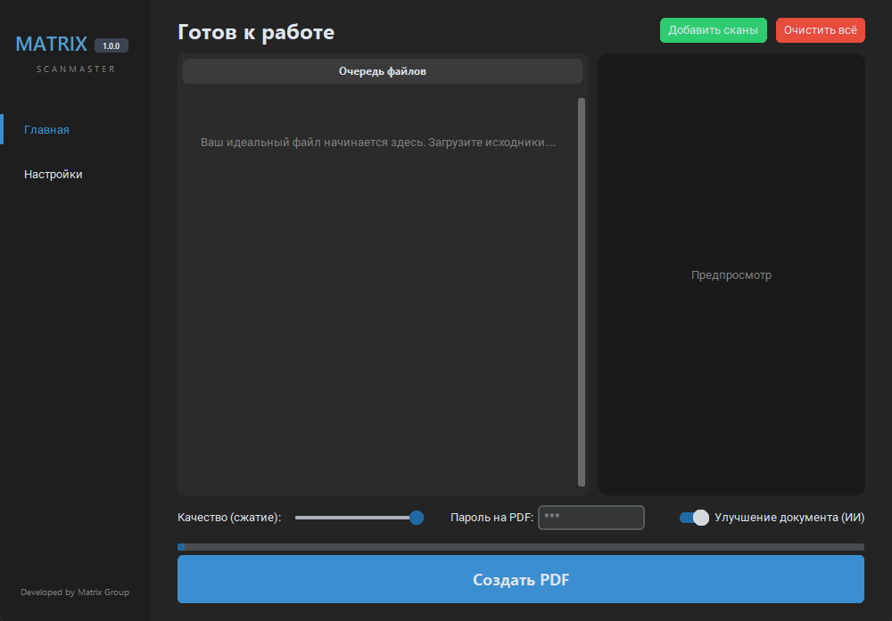

# 📄 ScanMaster Pro

  
   
  <b>Инженерия Эффективности: Профессиональный комбайн для работы с PDF.</b>

  
  
  

---

## 🚀 О проекте

**ScanMaster Pro** — это мощное настольное приложение на базе Python, созданное для автоматизации ежедневных задач с документами. Объединяйте, улучшайте и защищайте ваши сканы в один клик, не покидая пределов своего ПК.

Мы верим, что работа с документами должна быть быстрой, а данные — оставаться в безопасности.

### ✨ Ключевые возможности:

- **🪄 Интеллектуальное AI-улучшение:** Автоматическая коррекция яркости, контрастности и четкости отсканированных страниц.
- **🔗 Бесшовное объединение:** Склеивайте десятки PDF-файлов в один структурированный документ мгновенно.
- **🛡 Безопасность прежде всего:** Вся обработка происходит локально. Ваши данные не отправляются в облако.
- **🔐 Продвинутое шифрование:** Установка паролей и прав доступа (AES-256) прямо при сохранении.
- **⚡ Оптимизация размера:** Умное сжатие без видимой потери качества текста.

---

## 📸 Интерфейс

  
   
  <i>Главная панель управления инструментами</i>

---

## 🛠 Технологический стек

Проект построен на современных библиотеках Python:
- **PySide6 / PyQt6** — для создания отзывчивого интерфейса.
- **PyMuPDF / Pikepdf** — для высокоскоростной манипуляции PDF-структурами.
- **OpenCV / Pillow** — для алгоритмов обработки изображений и AI-улучшения.

---

## ⚠️ Отказ от ответственности

Проект разработан исключительно в рамках **учебной деятельности**. Все совпадения с существующими коммерческими программными продуктами являются случайными.
